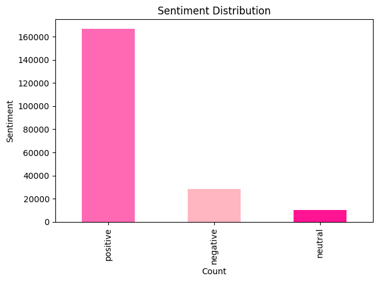
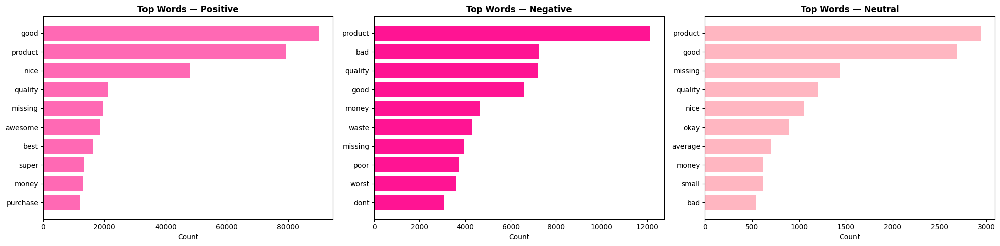
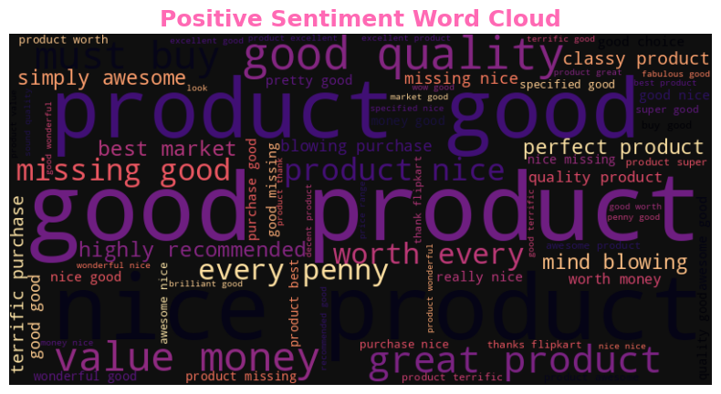
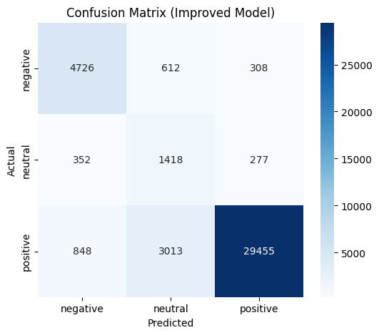
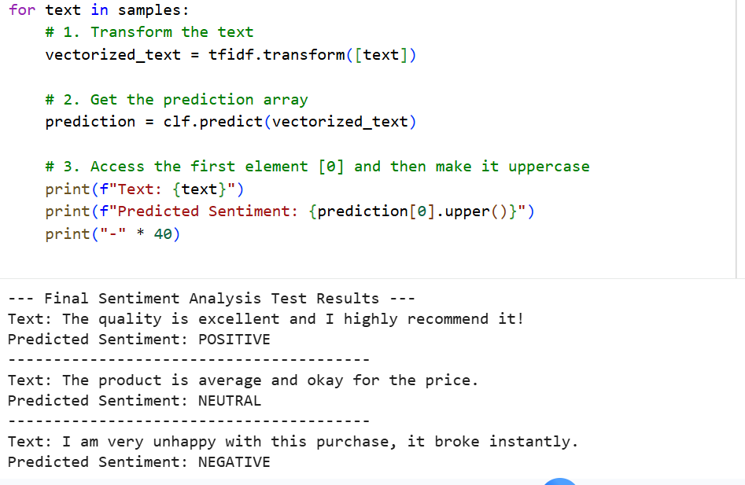

# Sentiment-analysis-project

This project performs sentiment analysis on Flipkart customer reviews using Natural Language Processing (NLP) and Machine Learning techniques.
This project demonstrates how machine learning and NLP can transform raw customer feedback into actionable business intelligence.

The goal of the project is to classify customer sentiments into:
- Positive
- Neutral
- Negative

using review text data from Flipkart products.

---

# Project Overview

Customer reviews contain valuable insights about product quality, customer satisfaction, and user experience. In this project, NLP techniques were used to clean and transform textual review data into machine-learning-ready features.

A Logistic Regression model was trained on TF-IDF vectorized text to predict customer sentiment.

---

# Dataset

Dataset Source: Kaggle Flipkart Product Customer Reviews Dataset

The dataset contains:
- Product Name
- Product Price
- Ratings
- Reviews
- Summary
- Sentiment Labels

🔗 Dataset Link:  
https://www.kaggle.com/datasets/niraliivaghani/flipkart-product-customer-reviews-dataset

---

# Techniques Used

## Data Preprocessing
- Missing value handling
- Text cleaning
- Tokenization
- Stopword removal
- Lemmatization

## Feature Engineering
- TF-IDF Vectorization
- Unigrams and Bigrams

## Machine Learning
- Logistic Regression
- Balanced class weighting

## Evaluation
- Accuracy Score
- Classification Report
- Confusion Matrix
- Custom Sentiment Prediction

---

# Visualizations

## Sentiment Distribution
Shows the distribution of positive, neutral, and negative reviews across the dataset, helping to identify overall customer sentiment trends.

## Top Frequent Words
Highlights the most common words associated with different sentiment categories, providing deeper insight into recurring customer opinions and expressions.

## Word Cloud
Shows the most frequent words across sentiments.

## Confusion Matrix
Evaluates classification performance across sentiment classes.

# Results

The model demonstrated strong performance in classifying customer sentiments and showed the effectiveness of NLP techniques for real-world e-commerce review analysis.

---

# Business Value & Real-World Impact

Customer reviews contain valuable insights that businesses can use to improve products, services, and customer experience.

This sentiment analysis project demonstrates how Natural Language Processing (NLP) can help e-commerce platforms automatically understand customer opinions at scale.

###  Potential Business Applications

- **Customer Feedback Monitoring**  
  Automatically identify whether customer opinions are positive, neutral, or negative.

- **Product Improvement**  
  Detect recurring complaints and common issues mentioned in negative reviews.

- **Customer Satisfaction Analysis**  
  Measure how customers feel about products and overall shopping experience.

- **Decision Making**  
  Help businesses make data-driven decisions using customer sentiment trends.

- **Brand Reputation Tracking**  
  Monitor public perception of products and identify reputation risks early.

- **Market Intelligence**  
  Discover patterns in customer preferences and purchasing behavior.

By transforming unstructured text into actionable insights, sentiment analysis can support smarter business strategies and improve customer engagement.

# Tools & Libraries

- Python
- Pandas
- NumPy
- NLTK
- Scikit-learn
- Matplotlib
- Seaborn
- WordCloud

---

# Project Files

- `flipkart_sentiment_analysis.ipynb` → Main notebook
- `Dataset-SA.csv` → Dataset
- `images/` → Visualization outputs

---

# 👩‍💻 Author

Aleem Muinat Abimbola

Data professional 
